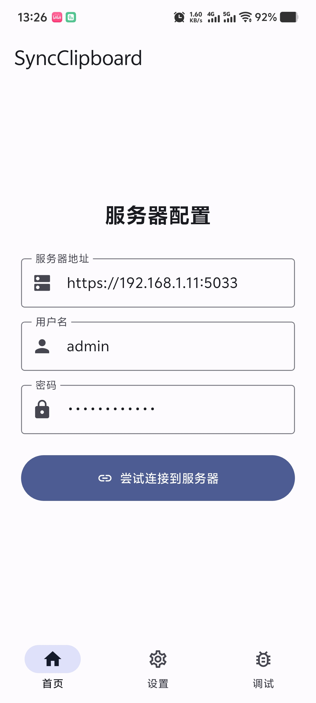
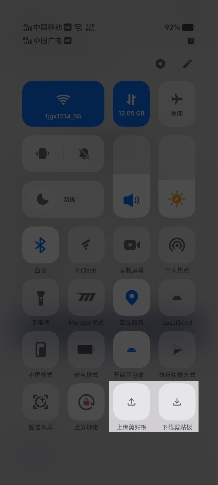
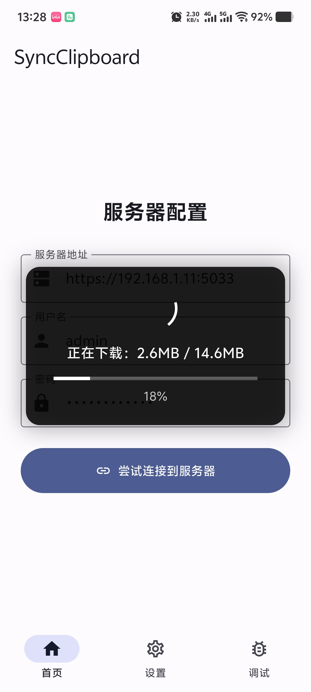

<h1 align="center">📋 Sync Clipboard Flutter</h1>

<p align="center">
  <strong>跨设备剪贴板同步 · 即用即走 · 安卓原生体验</strong>
</p>

<div align="center">
  
</div>
<br>

<div align="center">
  <a href="https://github.com/bling-yshs/sync-clipboard-tauri/stargazers"></a>
  <a href="https://github.com/bling-yshs/sync-clipboard-tauri/releases/latest"></a>
  <a href="https://github.com/bling-yshs/sync-clipboard-tauri/releases"></a>
  <a href="https://github.com/bling-yshs/sync-clipboard-tauri/blob/main/LICENSE"></a>
</div>
<br>

> [!IMPORTANT]
> 本项目原先使用 Tauri + Vue 开发，现已迁移至 Flutter。如需查看 Tauri 版本的代码，请切换到 [`archive-tauri`](https://github.com/bling-yshs/sync-clipboard-tauri/tree/archive-tauri) 分支。

## ✨ 项目简介

本项目是一个使用 Flutter 构建的 Material 3 风格的安卓客户端应用，作为 [Jeric-X/SyncClipboard](https://github.com/Jeric-X/SyncClipboard) 项目的配套应用，实现跨设备的剪贴板内容同步功能。

## 🚀 功能特性

- 📤 **剪贴板上传** - 将剪贴板内容上传到 SyncClipboard 服务器
- 📥 **剪贴板下载** - 从 SyncClipboard 服务器下载文本并写入到剪贴板
- 📁 **文件同步** - 支持单个图片/文件的上传和下载
- 📦 **文件组下载** - 支持 group 类型的下载（但不支持 group 的上传）
- 📲 **安卓原生分享** - 支持从其他应用分享文本或文件到本应用进行上传
- ⚡ **即用即走** - 上传/下载剪贴板后，将自动退出 app

## 📖 使用步骤

### 1️⃣ 下载安装

下载最新版本的 [Sync Clipboard Flutter](https://github.com/bling-yshs/sync-clipboard-tauri/releases/latest) 并安装

### 2️⃣ 配置服务器

打开 app，进入设置页面，填写 SyncClipboard 服务器配置（支持 WebDAV 服务器）

<div align="center">
  
</div>

### 3️⃣ 添加磁贴

打开控制中心，添加磁贴「上传剪贴板」与「下载剪贴板」

<div align="center">
  
</div>

### 4️⃣ 开始使用

点击磁贴开始使用

<div align="center">
  
</div>

> [!TIP]
> 您可以从相册或文件管理器中**长按图片/文件**，选择 **分享** 到本 App 来上传文件。或把图片/文件复制到剪贴板内再上传。

## 📂 项目结构

```
sync-clipboard-flutter/
├── lib/                        # 📱 Flutter 源码
│   ├── main.dart               # 🚀 应用入口
│   ├── page/                   # 📄 页面组件
│   │   ├── main_page.dart      # 🏠 主页面（底部导航）
│   │   ├── home_page.dart      # 🏡 首页
│   │   ├── config_page.dart    # ⚙️ 设置页面
│   │   ├── debug_page.dart     # 🐛 调试页面
│   │   ├── tile_page.dart      # 🔲 磁贴透明页面
│   │   └── share_upload_page.dart  # 📤 分享上传页面
│   ├── model/                  # 📦 数据模型
│   │   ├── app_settings/       # ⚙️ 应用设置
│   │   ├── server_config/      # 🌐 服务器配置
│   │   └── clipboard/          # 📋 剪贴板数据
│   ├── router/                 # 🛣️ go_router 路由配置
│   ├── dio/                    # 🌐 网络请求客户端
│   └── constants/              # 📌 常量定义
├── android/                    # 🤖 Android 平台代码
│   └── app/src/main/kotlin/    # 📝 Kotlin 原生代码
│       ├── MainActivity.kt
│       ├── TileActionActivity.kt       # 🔲 磁贴动作活动
│       ├── UploadClipboardTileService.kt   # ⬆️ 上传磁贴服务
│       └── DownloadClipboardTileService.kt # ⬇️ 下载磁贴服务
└── pubspec.yaml                # 📦 Flutter 依赖配置
```

## 🛠️ 开发环境

| 环境 | 版本要求 |
|:---:|:---:|
| 🐦 Flutter | 3.38.3 |
| 🎯 Dart SDK | ^3.10.1 |
| 🤖 Android SDK | 21+ |

## 🔨 构建指南

```bash
# 📦 安装依赖
flutter pub get

# 🚀 运行开发版本
flutter run

# 📱 构建 ARM64 Release APK
flutter build apk --release --target-platform android-arm64
```

## 📄 许可证

本项目采用 [MIT](LICENSE) 开源许可证。
